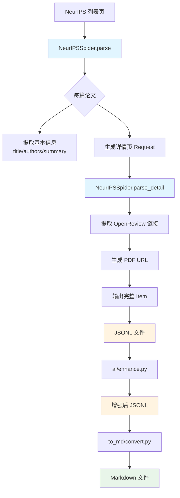

# 设计文档：NeurIPS 会议论文爬取与增强

## Overview

### 设计目标
在现有 arXiv 爬虫系统基础上，新增独立的 NeurIPS 会议论文爬取功能，复用 AI 增强流程，实现零破坏性扩展。

### 核心设计原则

1. **零破坏性**：不修改现有 arXiv 爬虫和 Pipeline 代码
2. **清晰分离**：NeurIPS 爬虫独立运行，自包含所有逻辑
3. **数据兼容**：输出格式与 arXiv 一致，可无缝对接 AI 增强流程
4. **优雅降级**：网络错误或数据缺失时仍能输出基本信息

### 架构概览



**关键决策：**
- NeurIPSSpider **禁用 Pipeline**，直接输出完整数据（避免 arXiv API 依赖）
- 使用 Scrapy 的链式请求实现两阶段爬取
- 错误处理采用优雅降级（缺少 PDF 时仍输出基本信息）

---

## Architecture

### 文件结构

```
E:\MarssPython\2511-daily-arXiv/
├── daily_arxiv/daily_arxiv/
│   ├── spiders/
│   │   ├── arxiv.py          # [不变] 现有 arXiv 爬虫
│   │   └── neurips.py        # [新增] NeurIPS 爬虫
│   ├── items.py              # [不变] Item 定义
│   ├── pipelines.py          # [不变] arXiv 专用 Pipeline
│   └── settings.py           # [不变] 全局配置
├── ai/
│   ├── enhance.py            # [不变] AI 增强脚本
│   ├── structure.py          # [不变] 输出结构定义
│   └── template.txt          # [不变] Prompt 模板
├── to_md/
│   └── convert.py            # [可能微调] Markdown 转换
├── data/
│   ├── neurips-2024-oral.jsonl           # [新增] 爬取输出
│   ├── neurips-2024-oral_AI_enhanced_Chinese.jsonl  # [新增] AI 增强输出
│   └── neurips-2024-oral.md              # [新增] Markdown 输出
└── specs/neurips-paper-crawler/
    ├── requirements.md       # 需求文档
    └── design.md            # 本文档
```

**变更影响分析：**
- **零修改**：`arxiv.py`, `pipelines.py`, `items.py`, `settings.py`
- **新增文件**：`neurips.py`（~200行）
- **可能微调**：`convert.py`（如果需要识别 `source` 字段）

---

## Components and Interfaces

### Component 1: NeurIPSSpider

**文件路径**：`daily_arxiv/daily_arxiv/spiders/neurips.py`

**职责**：
- 爬取 NeurIPS 2024 Oral 论文列表页
- 提取基本信息（title, authors, summary）
- 爬取详情页获取 OpenReview 链接
- 生成 PDF 下载链接
- 输出标准化 JSONL 格式

**接口设计**：

```python
import scrapy
from typing import Iterator, Dict

class NeuripsSpider(scrapy.Spider):
    """NeurIPS 会议论文爬虫"""

    name = "neurips"
    allowed_domains = ["neurips.cc", "openreview.net"]

    # 爬虫参数（支持未来扩展）
    def __init__(self, year: str = "2024", category: str = "oral", *args, **kwargs):
        super().__init__(*args, **kwargs)
        self.year = year
        self.category = category
        self.start_urls = [
            f"https://neurips.cc/virtual/{year}/events/{category}"
        ]

    # 自定义配置：禁用 Pipeline + 礼貌爬取
    custom_settings = {
        'ITEM_PIPELINES': {},  # 禁用 Pipeline
        'DOWNLOAD_DELAY': 1,   # 1秒请求间隔
        'CONCURRENT_REQUESTS': 1,  # 单线程爬取
        'ROBOTSTXT_OBEY': True,
    }

    def parse(self, response) -> Iterator[scrapy.Request]:
        """解析列表页，提取论文基本信息"""
        pass

    def parse_detail(self, response) -> Iterator[Dict]:
        """解析详情页，提取 OpenReview 链接和 PDF URL"""
        pass

    def _extract_paper_info(self, section) -> Dict:
        """从页面 section 中提取论文基本信息"""
        pass

    def _extract_openreview_link(self, response) -> str:
        """从详情页提取 OpenReview 链接"""
        pass

    def _generate_pdf_url(self, openreview_link: str) -> str:
        """从 OpenReview 论坛链接生成 PDF 下载链接"""
        pass
```

**关键方法说明**：

1. **`parse(response)`**
   - 输入：列表页 HTML
   - 处理流程：
     1. 使用 CSS 选择器提取每篇论文的 section（基于前期网页分析）
     2. 提取基本信息：title, authors, summary
     3. 提取详情页链接（如 `/virtual/2024/oral/97958`）
     4. 为每个详情页生成 `scrapy.Request`，传递基本信息到 `parse_detail`
   - 输出：`Iterator[scrapy.Request]`

2. **`parse_detail(response)`**
   - 输入：详情页 HTML + 从 `parse` 传递的基本信息
   - 处理流程：
     1. 提取 OpenReview 链接（如 `https://openreview.net/forum?id=m1a4CrRJR7`）
     2. 从 OpenReview 链接提取 ID，生成 PDF URL
     3. 合并所有字段，生成完整 Item
     4. 如果 OpenReview 链接不存在，PDF 字段设为空字符串
   - 输出：`Iterator[Dict]`（Item 字典）

3. **`_extract_openreview_link(response)`**
   - 鲁棒性设计：
     ```python
     # 候选选择器（按优先级）
     selectors = [
         'a:contains("OpenReview")::attr(href)',
         'a[href*="openreview.net"]::attr(href)',
         # 更多候选...
     ]
     for selector in selectors:
         link = response.css(selector).get()
         if link:
             return link
     return ""  # 未找到时返回空字符串
     ```

**错误处理策略**：
- 详情页请求失败 → 记录警告，输出基本信息（PDF 字段留空）
- OpenReview 链接缺失 → PDF 字段设为空字符串，继续输出
- 必需字段缺失（title 或 summary）→ 记录错误，跳过该论文

---

### Component 2: 数据流集成

**无需新增组件**，但需验证兼容性：

#### 2.1 AI 增强流程（`ai/enhance.py`）

**当前实现分析**：
```python
def parse_args():
    parser.add_argument("--data", type=str, required=True, help="jsonline data file")
    # ...
```

**兼容性验证**：
- ✅ 输入：接受任意 JSONL 文件路径
- ✅ 字段要求：只需 `summary` 字段（NeurIPS 输出包含）
- ✅ `source` 字段：脚本不读取此字段，仅透传到输出
- ✅ 输出文件名：基于输入文件名自动生成（如 `neurips-2024-oral_AI_enhanced_Chinese.jsonl`）

**结论**：无需修改，直接可用。

#### 2.2 Markdown 转换（`to_md/convert.py`）

**需要验证的点**：
1. 是否需要识别 `source` 字段以生成不同格式？
2. 是否需要添加 YAML front matter？

**预期调整**（如果需要）：
```python
# convert.py 中添加元数据支持
if item.get('source') == 'neurips':
    md_content = f"""---
title: NeurIPS 2024 Oral Papers
source: neurips
year: 2024
category: oral
---

{paper_content}
"""
```

**决策点**：这部分需要你确认，`to_md/convert.py` 当前是否已支持元数据？还是需要我们扩展？

---

## Data Models

### Item 结构

**NeurIPS Item 输出格式**（与 arXiv 兼容）：

```json
{
  "id": "neurips2024_oral_97958",
  "title": "Generalization Error Bounds for Two-stage Recommender Systems with Tree Structure",
  "authors": [
    "Jin Zhang",
    "Ze Liu",
    "Defu Lian",
    "Enhong Chen"
  ],
  "summary": "Two-stage recommender systems play a crucial role...",
  "abs": "https://neurips.cc/virtual/2024/oral/97958",
  "pdf": "https://openreview.net/pdf?id=m1a4CrRJR7",
  "categories": ["NeurIPS 2024 Oral"],
  "comment": null,
  "source": "neurips"
}
```

**字段说明**：

| 字段 | 类型 | 说明 | 来源 | 错误处理 |
|------|------|------|------|----------|
| `id` | string | 唯一标识符 | 从详情页 URL 提取（如 `97958`） | 必需，缺失则跳过 |
| `title` | string | 论文标题 | 列表页 CSS 提取 | 必需，缺失则跳过 |
| `authors` | array[string] | 作者列表 | 列表页 CSS 提取 | 必需，缺失则跳过 |
| `summary` | string | 摘要 | 列表页 CSS 提取 | 必需，缺失则跳过 |
| `abs` | string | 详情页链接 | 列表页 href 提取 | 必需，缺失则跳过 |
| `pdf` | string | PDF 下载链接 | 详情页 → OpenReview ID → 拼接 | 可选，缺失则为 `""` |
| `categories` | array[string] | 分类标签 | 硬编码 `["NeurIPS 2024 Oral"]` | 固定值 |
| `comment` | null/string | 备注信息 | 固定为 `null` | 固定值 |
| `source` | string | 数据来源标识 | 硬编码 `"neurips"` | 固定值 |

**与 arXiv 输出对比**：

| 差异点 | arXiv | NeurIPS | 兼容性 |
|--------|-------|---------|--------|
| `id` 格式 | `2024.12345` | `neurips2024_oral_97958` | ✅ 都是字符串 |
| `pdf` 域名 | `arxiv.org` | `openreview.net` | ✅ 都是完整 URL |
| `categories` | `["cs.AI", "cs.LG"]` | `["NeurIPS 2024 Oral"]` | ✅ 都是字符串数组 |
| `source` 字段 | 无 | `"neurips"` | ✅ 新增字段，不影响现有逻辑 |

**AI 增强后的数据模型**：

```json
{
  // 原始字段（上述所有字段）
  "id": "neurips2024_oral_97958",
  "title": "...",
  // ... 其他字段

  // AI 增强字段（由 structure.py 定义）
  "core_problem": "...",
  "key_insight": "...",
  "method": "...",
  "method_formula": "...",
  "core_finding": "...",
  "mechanism_insight": "...",
  "action_value": "...",
  "transferability": "...",
  "value_score": "...",
  "summary_core": "...",
  "summary_layman": "..."
}
```

---

## Error Handling

### 错误分类与处理策略

#### 1. 网络错误

| 错误类型 | 场景 | 处理策略 | 日志级别 |
|---------|------|---------|---------|
| HTTP 404 | 详情页不存在 | 记录错误，输出基本信息（PDF 留空） | WARNING |
| HTTP 500 | 服务器错误 | Scrapy 自动重试 3 次，失败后记录错误 | ERROR |
| 超时 | 网络慢 | Scrapy 默认超时重试 | WARNING |
| DNS 解析失败 | 域名问题 | 立即失败，记录 CRITICAL | CRITICAL |

**Scrapy 配置**：
```python
custom_settings = {
    'RETRY_TIMES': 3,
    'RETRY_HTTP_CODES': [500, 502, 503, 504, 408, 429],
    'DOWNLOAD_TIMEOUT': 30,
}
```

#### 2. 数据解析错误

| 错误类型 | 场景 | 处理策略 | 日志级别 |
|---------|------|---------|---------|
| 必需字段缺失 | title/summary 为空 | 跳过该论文，记录警告 | WARNING |
| OpenReview 链接缺失 | 详情页无链接 | PDF 字段设为 `""`，继续输出 | INFO |
| 作者列表为空 | CSS 选择器失效 | 设为 `[]`，继续输出 | WARNING |
| 详情页 ID 提取失败 | URL 格式变化 | 跳过该论文，记录错误 | ERROR |

**优雅降级示例**：
```python
def parse_detail(self, response):
    item = response.meta['item']  # 从 parse 传递的基本信息

    # 尝试提取 OpenReview 链接
    openreview_link = self._extract_openreview_link(response)
    if openreview_link:
        item['pdf'] = self._generate_pdf_url(openreview_link)
    else:
        item['pdf'] = ""
        self.logger.info(f"No OpenReview link found for {item['id']}, PDF field left empty")

    yield item  # 即使缺少 PDF 也输出
```

#### 3. 统计与报告

**爬取结束时输出统计**：
```python
def closed(self, reason):
    self.logger.info(f"""
    ===== NeurIPS Crawler Statistics =====
    Total papers processed: {self.stats.get('item_scraped_count', 0)}
    Successful items: {self.stats.get('item_scraped_count', 0)}
    Failed detail pages: {self.failed_count}
    Papers without PDF: {self.no_pdf_count}
    ======================================
    """)
```

**错误率阈值告警**：
```python
# 在 closed() 方法中
failed_rate = self.failed_count / total if total > 0 else 0
if failed_rate > 0.5:
    self.logger.error(
        f"ALERT: Over 50% of papers failed to crawl ({failed_rate:.1%}). "
        f"Please check if the website structure has changed."
    )
```

---

## Testing Strategy

### 单元测试

**不建议为 Spider 写传统单元测试**，理由：
- Scrapy Spider 高度依赖真实 HTTP 响应
- Mock HTML 响应成本高且脆弱（网页结构变化频繁）

**替代方案：使用 Scrapy Contracts**

```python
class NeuripsSpider(scrapy.Spider):
    def parse(self, response):
        """ Parse the NeurIPS oral papers list page.

        @url https://neurips.cc/virtual/2024/events/oral
        @returns items 10 60
        @returns requests 0 0
        @scrapes title authors summary abs
        """
        # 实现...

    def parse_detail(self, response):
        """ Parse paper detail page for OpenReview link.

        @url https://neurips.cc/virtual/2024/oral/97958
        @returns items 1 1
        @scrapes pdf
        """
        # 实现...
```

**运行测试**：
```bash
scrapy check neurips
```

### 集成测试

**测试场景 1：完整爬取流程**

```bash
# 1. 运行爬虫（限制 5 篇论文用于测试）
scrapy crawl neurips -o test_output.jsonl -s CLOSESPIDER_ITEMCOUNT=5

# 2. 验证输出
python -c "
import json
with open('test_output.jsonl') as f:
    items = [json.loads(line) for line in f]
    assert len(items) == 5, f'Expected 5 items, got {len(items)}'
    for item in items:
        assert 'id' in item
        assert 'title' in item
        assert 'authors' in item
        assert 'summary' in item
        assert item['source'] == 'neurips'
        print(f'✓ {item[\"id\"]}: {item[\"title\"][:50]}...')
print('✅ All tests passed')
"

# 3. 测试 AI 增强
cd ai
python enhance.py --data ../test_output.jsonl --max_workers 2

# 4. 验证增强输出
python -c "
import json
with open('test_output_AI_enhanced_Chinese.jsonl') as f:
    items = [json.loads(line) for line in f]
    assert 'core_problem' in items[0], 'AI enhancement failed'
print('✅ AI enhancement works')
"
```

**测试场景 2：错误处理**

```python
# 创建测试脚本 test_error_handling.py
import scrapy
from scrapy.http import HtmlResponse, Request

def test_missing_openreview():
    """测试缺少 OpenReview 链接的情况"""
    spider = NeuripsSpider()

    # Mock response without OpenReview link
    url = 'https://neurips.cc/virtual/2024/oral/99999'
    body = '<html><body><h1>Paper Title</h1></body></html>'
    response = HtmlResponse(url=url, body=body.encode())
    response.meta['item'] = {
        'id': 'neurips2024_oral_99999',
        'title': 'Test Paper',
        'authors': ['Author 1'],
        'summary': 'Test summary',
        'abs': url,
    }

    # 执行 parse_detail
    items = list(spider.parse_detail(response))

    assert len(items) == 1
    assert items[0]['pdf'] == ""  # PDF 字段应为空
    print("✅ Missing OpenReview link handled correctly")

# 运行测试
test_missing_openreview()
```

### 手动验证清单

**首次部署前的验证步骤**：

- [ ] **Step 1**：爬取 5 篇论文
  ```bash
  cd daily_arxiv
  scrapy crawl neurips -o ../data/test.jsonl -s CLOSESPIDER_ITEMCOUNT=5
  ```
  - 验证：生成 `test.jsonl`，包含 5 条记录
  - 验证：每条记录有 `id`, `title`, `authors`, `summary`, `abs`, `pdf`, `source`

- [ ] **Step 2**：检查日志无致命错误
  - 验证：日志中无 `ERROR` 或 `CRITICAL` 级别消息
  - 验证：统计信息显示 `item_scraped_count = 5`

- [ ] **Step 3**：手动检查数据质量
  ```bash
  python -c "import json; [print(json.loads(line)['title']) for line in open('data/test.jsonl')]"
  ```
  - 验证：标题是完整的论文标题（不是 HTML 片段）
  - 验证：作者列表是数组（不是字符串）
  - 验证：PDF 链接格式正确（`openreview.net/pdf?id=...`）

- [ ] **Step 4**：AI 增强测试
  ```bash
  cd ai
  python enhance.py --data ../data/test.jsonl --max_workers 2
  ```
  - 验证：生成 `test_AI_enhanced_Chinese.jsonl`
  - 验证：增强后文件包含 AI 字段（如 `core_problem`）

- [ ] **Step 5**：Markdown 转换测试
  ```bash
  cd to_md
  python convert.py --data ../data/test_AI_enhanced_Chinese.jsonl
  ```
  - 验证：生成 Markdown 文件
  - 验证：格式正确（标题、作者、摘要可见）

- [ ] **Step 6**：完整爬取（所有 Oral 论文）
  ```bash
  cd daily_arxiv
  scrapy crawl neurips -o ../data/neurips-2024-oral.jsonl
  ```
  - 验证：爬取完成（预计 50-80 篇论文）
  - 验证：失败率 < 10%

---

## Implementation Plan

### 阶段 1：核心爬虫实现（P0）

**预计时间**：1-2 小时

**任务**：
1. 创建 `neurips.py`，实现 `NeuripsSpider` 类
2. 实现 `parse()` 方法（列表页解析）
3. 实现 `parse_detail()` 方法（详情页解析）
4. 实现辅助方法（`_extract_*`, `_generate_pdf_url`）
5. 添加错误处理和日志

**验证标准**：
- 运行 `scrapy crawl neurips -o test.jsonl -s CLOSESPIDER_ITEMCOUNT=5`
- 生成 5 条有效记录，字段完整

---

### 阶段 2：AI 增强集成验证（P1）

**预计时间**：30 分钟

**任务**：
1. 使用测试数据运行 `ai/enhance.py`
2. 验证输出文件包含 AI 字段
3. 检查是否有格式兼容问题

**验证标准**：
- AI 增强成功完成
- 无字段类型错误

---

### 阶段 3：Markdown 转换调整（P1）

**预计时间**：30 分钟 - 1 小时

**任务**：
1. 检查 `to_md/convert.py` 是否需要识别 `source` 字段
2. 如需要，添加 YAML front matter 支持
3. 验证生成的 Markdown 格式正确

**验证标准**：
- 生成的 Markdown 文件可读
- 包含正确的元数据（如果需要）

---

### 阶段 4：完整流程测试（P1）

**预计时间**：1 小时

**任务**：
1. 爬取所有 NeurIPS 2024 Oral 论文
2. 运行 AI 增强
3. 生成 Markdown
4. 发布到 GitHub Pages（手动验证）

**验证标准**：
- 数据完整性 > 90%
- GitHub Pages 正常显示

---

### 阶段 5：文档与清理（P2）

**预计时间**：30 分钟

**任务**：
1. 更新项目 README，添加 NeurIPS 爬虫使用说明
2. 添加代码注释
3. 清理测试文件

**验证标准**：
- README 包含完整的使用示例
- 代码注释清晰

---

## 关键决策记录

### 决策 1：禁用 Pipeline vs 修改 Pipeline

**选择**：NeurIPS Spider 禁用 Pipeline，直接输出完整数据

**理由**：
- ✅ 零破坏性：完全不改现有代码
- ✅ 职责清晰：arXiv 需要 API 补全，NeurIPS 不需要
- ✅ 易维护：未来添加其他会议时灵活选择
- ❌ 代价：Spider 代码稍长（需要自己处理所有字段）

**替代方案**：修改 `DailyArxivPipeline`，增加 `if item.get('source') == 'neurips'` 判断
**为何拒绝**：增加耦合度，违反"零破坏性"原则

---

### 决策 2：优雅降级 vs 严格验证

**选择**：缺少 PDF 链接时仍输出基本信息

**理由**：
- ✅ 数据可用性优先：至少能拿到标题和摘要用于 AI 分析
- ✅ 网络友好：减少因详情页失败导致的数据丢失
- ❌ 代价：输出数据可能不完整

**替代方案**：缺少 PDF 时跳过整篇论文
**为何拒绝**：过于严格，损失有价值的数据

---

### 决策 3：ID 生成策略

**选择**：从详情页 URL 提取 ID（如 `97958`）

**理由**：
- ✅ 稳定性：URL 中的 ID 是 NeurIPS 官方标识符
- ✅ 可追溯：可通过 ID 反向构造 URL
- ❌ 代价：依赖 URL 格式不变

**替代方案**：
- 使用 OpenReview ID：需要爬详情页才能生成，增加依赖
- 简单递增：不稳定，重新爬取会改变

---

## 未来扩展点

### 扩展 1：Spotlight 论文支持（3个月内）

**设计思路**：
```python
# 使用爬虫参数支持多类别
scrapy crawl neurips -a year=2024 -a category=spotlight

# 修改 start_urls 逻辑
self.start_urls = [
    f"https://neurips.cc/virtual/{year}/events/{category}"
]

# 调整 categories 字段
item['categories'] = [f"NeurIPS {self.year} {self.category.capitalize()}"]
```

**预计工作量**：1-2 小时（主要是测试）

---

### 扩展 2：PDF 全文下载与分析（3个月内）

**设计思路**：
1. 在 Spider 中添加 PDF 下载逻辑：
   ```python
   def parse_detail(self, response):
       # ... 现有逻辑

       if item['pdf']:
           yield scrapy.Request(
               item['pdf'],
               callback=self.download_pdf,
               meta={'item': item}
           )
   ```

2. 保存 PDF 到本地：
   ```python
   def download_pdf(self, response):
       item = response.meta['item']
       pdf_path = f"data/pdfs/{item['id']}.pdf"
       with open(pdf_path, 'wb') as f:
           f.write(response.body)
       item['pdf_local'] = pdf_path
       yield item
   ```

3. 使用 MCP 工具或 LangChain 的 PDF Loader 进行全文分析

**预计工作量**：4-8 小时（含 PDF 解析逻辑）

---

### 扩展 3：历史年份支持（按需）

**设计思路**：
```bash
# 爬取 2023 年 Oral
scrapy crawl neurips -a year=2023 -a category=oral

# 批量爬取多年
for year in 2020 2021 2022 2023 2024; do
    scrapy crawl neurips -a year=$year -o neurips-$year-oral.jsonl
done
```

**注意事项**：
- 老版本网页结构可能不同，需要添加版本检测逻辑
- 建议每年单独测试 CSS 选择器

---

## 附录：CSS 选择器参考

基于前期网页分析，以下是关键的 CSS 选择器（实际实现时需验证）：

### 列表页选择器

```python
# 论文条目（每个 <h2> + <p> 组合）
papers = response.css('h2')  # 每个 h2 是一篇论文的标题

for paper_title in papers:
    # 标题
    title = paper_title.css('::text').get()

    # 作者（紧随 <h2> 后的第二个 <p>）
    authors_text = paper_title.xpath('following-sibling::p[2]/text()').get()
    authors = [a.strip() for a in authors_text.split('·')]

    # 摘要（<p>Abstract</p> 后的段落）
    summary = paper_title.xpath('following-sibling::p[contains(text(), "Abstract")]/following-sibling::text()[1]').get()

    # 详情页链接（需要从页面结构推断）
    detail_url = ...  # 待实际分析页面后确定
```

### 详情页选择器

```python
# OpenReview 链接
openreview_link = response.css('a:contains("OpenReview")::attr(href)').get()

# 或
openreview_link = response.css('a[href*="openreview.net"]::attr(href)').get()
```

**注意**：这些选择器是基于初步分析的假设，实际实现时需要根据真实 HTML 结构调整。

---

## 总结

本设计文档基于以下核心原则：

1. **零破坏性**：通过禁用 Pipeline 实现完全独立
2. **简单优先**：使用 Scrapy 标准模式，避免过度设计
3. **优雅降级**：缺少非关键字段时仍能输出有价值的数据
4. **可扩展性**：预留参数化接口，支持未来扩展

**关键风险**：
- 网页结构变化导致 CSS 选择器失效（通过多候选选择器 + 详细日志缓解）
- OpenReview 链接缺失（通过优雅降级处理）

**预计总工作量**：4-6 小时（含测试）

**下一步**：根据本设计生成任务清单，开始实现。
